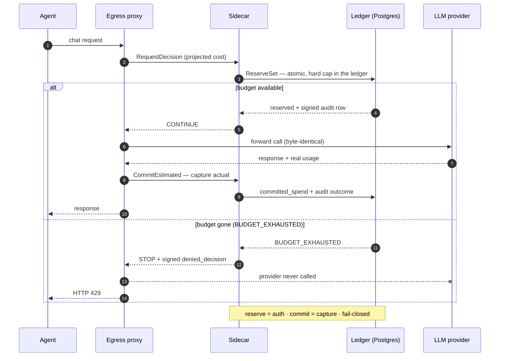

<div align="center">

# 🛡️ Agentic SpendGuard

**English** · [繁體中文](README.zh-TW.md) · [简体中文](README.zh-CN.md)

**The spend firewall for LLM agents.**

Reserve budget *before* the provider is called — refuse the call the moment the
budget is gone, with a signed audit trail of why. Not another dashboard that
shows you the bill after it lands.

🔌 **~20 in-process gating adapters** — LangChain · OpenAI Agents · Vercel AI ·
Mastra · LlamaIndex · AutoGen · Strands · n8n · Dify · LiteLLM … — plus drop-in
recipes for any OpenAI-compatible client.

[](LICENSE)
[](https://pypi.org/project/spendguard-sdk/)
[](https://www.npmjs.com/package/@spendguard/sdk)
[](docs/integrations.md)
[](services/)
[](services/ledger/migrations/)
[](proto/)
[](CONTRIBUTING.md)

[Quick start](#-quick-start) · [How it works](#%EF%B8%8F-how-it-works) · [Benchmark](#-benchmark) · [Integrations](docs/integrations.md) · [Architecture](ARCHITECTURE.md)

</div>

---

## Why

A support agent hits a rate-limited tool at 2:47am. The retry loop re-plans,
re-prompts, re-tries — each retry a fresh `gpt-4o` call with the full context.
Forty minutes later one stuck conversation has burned ~$380. You find out when
the provider dashboard updates the next morning.

"Track usage and send alerts" is **reconciliation** — you see the bill after it
lands. SpendGuard is **control**: every request reserves budget against a
per-tenant ledger *before* the provider is called. Budget gone → the call is
refused and the provider is never hit.

If you've used Stripe: this is **auth/capture, applied to LLM tokens.** Reserve
the estimated cost pre-call; capture the real `usage` post-call. Idempotent,
atomic, fail-closed.

<p align="center">
  
</p>

<p align="center"><sub>A $2000 claim against a $1000 hard cap — <b>refused before the provider is called</b>, with a signed <code>denied_decision</code> audit row. Reproduce locally: <code>make demo-up DEMO_MODE=deny</code></sub></p>

## 🚀 Quick start

### 1. See it stop a runaway loop — 30 s, no API key

```bash
git clone https://github.com/m24927605/agentic-spendguard.git
cd agentic-spendguard
make try          # Docker only — no OpenAI key, no real spend
```

`make try` runs the [runaway-loop benchmark](#-benchmark): an agent tries 100
calls against a $1.00 budget, head-to-head with two other budget tools, against
a **mock** LLM (so no provider key and nothing real is spent). You'll watch
SpendGuard stop *pre-call* at **$0.90** while `agent-guard` runs the loop all the
way to **$18** — 20× over budget — without noticing.

### 2. Put it in front of your own `gpt-4o` calls

```bash
export OPENAI_API_KEY=sk-...
make demo-up DEMO_MODE=proxy
```

This brings up Postgres + ledger + sidecar + egress proxy and runs a real
`gpt-4o-mini` call through it. **Your application code changes by one line:**

```python
from openai import OpenAI

client = OpenAI(
    base_url="http://localhost:9000/v1",   # ← only change
    api_key=os.environ["OPENAI_API_KEY"],
)
client.chat.completions.create(model="gpt-4o-mini", messages=[...])
```

| Decision | HTTP | Result |
|---|---|---|
| **CONTINUE** (budget available) | 200 | Provider response byte-identical; ledger writes a `commit_estimated` audit row |
| **STOP** (over hard-cap) | 429 + `Retry-After` | Structured `spendguard_blocked` body — **the request never reaches the provider** |

## 📊 Benchmark

Identical fixture — 100 attempted calls, $1.00 budget, $0.18/call — through
three drop-in budget tools, measured against a ground-truth pricing table:

<p align="center">
  
</p>

| Runner | Wire calls | $ spent | Overshoot |
|---|---:|---:|---:|
| **Agentic SpendGuard** | 5 | $0.90 | **−10%** ✅ |
| `agentbudget` | 6 | $1.08 | +8% (enforces *post*-call) |
| `agent-guard` | 100 | $18.00 | **+1700%** ❌ (no-ops on a self-hosted base URL) |

SpendGuard does **pre-call reservation** against the ledger and refuses call #6
before it leaves the runner — the only one of the three that never overspends.
Run it yourself: **`make try`** (or `make benchmark` in
[`benchmarks/runaway-loop/`](benchmarks/runaway-loop/)).

## 🛡️ How it works

Three layers. The proxy is the only thing your client talks to.

```
agent ──HTTP──▶ egress-proxy ──UDS gRPC──▶ sidecar ──mTLS gRPC──▶ ledger
                     │                                              │
                     └── byte-identical forward on CONTINUE         ▼
                                              audit_outbox (signed, append-only)
                                                                    │
                                              outbox-forwarder ─▶ canonical_ingest ─▶ your SIEM
```

1. **Egress proxy** (Rust + axum) — speaks the OpenAI Chat Completions /
   Responses wire protocol; forwards byte-identically on `CONTINUE`, returns
   HTTP 429 on `STOP` without ever calling the provider.
2. **Sidecar** (Rust + tonic over UDS) — per-pod Contract DSL evaluator;
   decides `Continue` / `Stop` / `RequireApproval` / `Degrade`; signs every
   decision (Ed25519 or AWS KMS ECDSA P-256).
3. **Ledger + audit chain** (Postgres) — append-only double-entry ledger; the
   **hard cap is enforced in the ledger itself** (`BUDGET_EXHAUSTED`).
   `audit_outbox` rows are immutable (DB triggers) and signed — tamper-evident.

Per request — reserve before the call, capture the real cost after, refuse the
moment budget is gone:



→ Full details in **[ARCHITECTURE.md](ARCHITECTURE.md)**.

## 🎚️ Capability levels

Pick the trust model that fits how much the agent's code can be trusted not to
bypass the gate.

| Level | Mechanism | Residual bypass |
|---|---|---|
| **L0** advisory_sdk | SDK logs decisions; never blocks | code that skips the SDK |
| **L1** semantic_adapter | SDK refuses the upstream call on `STOP` | importing the provider client directly |
| **L2** egress_proxy_hard_block | network proxy rejects un-gated egress (+ NetworkPolicy) | none |
| **L3** provider_key_gateway | provider keys live server-side; agent never sees them | none |

## 🔌 Integrations

Two ways in: a **drop-in proxy** (one env var, no code) or a **framework
adapter** (wrap the model object). ~20 in-process gating adapters + drop-in
recipes ship — the installable ones:

### 🧩 Agent frameworks

| Framework | Install |
|---|---|
| LangChain / LangGraph | `pip install 'spendguard-sdk[langchain]'` · `npm i @spendguard/langchain` |
| OpenAI Agents SDK | `pip install 'spendguard-sdk[openai-agents]'` · `npm i @spendguard/openai-agents` |
| Vercel AI SDK | `npm i @spendguard/vercel-ai` |
| Mastra | `npm i @spendguard/mastra` |
| Inngest AgentKit | `npm i @spendguard/inngest-agent-kit` |
| Pydantic-AI · Google ADK · AWS Strands · LlamaIndex | `pip install 'spendguard-sdk[<name>]'` |
| DSPy · Agno · BeeAI · AutoGen / AG2 · SmolAgents · Letta · Atomic Agents | `pip install 'spendguard-sdk[<name>]'` |
| Microsoft Agent Framework | `pip install 'spendguard-sdk[agent-framework]'` · .NET adapter in [`sdk/dotnet-agent-framework/`](sdk/dotnet-agent-framework/) |

### 🔧 No-code / visual builders & gateways

| Tool | Install |
|---|---|
| n8n | `n8n-nodes-spendguard` (community node) |
| Flowise | `npm i @spendguard/flowise-nodes` (custom node) |
| Botpress | `npm i @spendguard/botpress-integration` |
| Dify | model-provider plugin — [`plugins/dify/`](plugins/dify/) |
| Langflow | custom component — [`plugins/langflow/`](plugins/langflow/) |
| Kong AI Gateway | Go plugin — [`plugins/kong/`](plugins/kong/) |
| LiteLLM (proxy guardrail · callback · SDK shim) | `pip install 'spendguard-sdk[litellm]'` |

### ⚡ Drop-in — one env var, no SDK

| Tool | How |
|---|---|
| Any OpenAI-compatible client | `base_url=<proxy>` |
| LobeChat | `OPENAI_PROXY_URL=<proxy>` |
| AnythingLLM | Generic-OpenAI provider Base URL |
| Coze Studio | model-provider Base URL |
| OpenClaw | custom-provider `baseUrl` (or `npm i @spendguard/openclaw-provider-plugin`) |
| Anthropic `claude-agent-sdk` | egress proxy + root CA (BYOK) |

**→ Full matrix (~40 surfaces — adapters + recipes + importers + experimental)** — incl. AG-UI spend events, LiveKit/Pipecat voice reservations,
vendor-VM usage importers (Devin · Manus · Genspark), the Microsoft Agent Governance
Toolkit ([merged upstream](https://github.com/microsoft/agent-governance-toolkit/pull/2398)),
install snippets, and per-integration demo gates: **[docs/integrations.md](docs/integrations.md).**

## 📦 SDK

For approval workflows, model degradation, or multi-budget claims, use the SDK
directly:

```bash
pip install spendguard-sdk          # Python
npm install @spendguard/sdk         # TypeScript
```

```python
async with SpendGuardClient(socket_path="/var/run/spendguard/adapter.sock",
                            tenant_id=TENANT) as sg:
    await sg.handshake()
    outcome = await sg.request_decision(trigger="LLM_CALL_PRE", ...)
    # CONTINUE → make the call; DecisionStopped / ApprovalRequired raise.
```

## 🚀 Running it

**Try it (demo, ~1 min):** `make demo-up DEMO_MODE=proxy` — the full stack via
[`deploy/demo/compose.yaml`](deploy/demo/compose.yaml) with PKI bootstrap and
internal mTLS. See [Quick start](#-quick-start).

**Run it for real (Kubernetes):**

1. Provision **Postgres 16**, **cert-manager** (internal mTLS), and — for
   production signing — **AWS KMS** (ECDSA P-256 via IRSA).
2. Install the stack with the production profile:
   ```bash
   helm install spendguard charts/spendguard \
     -f charts/spendguard/values-production.example.yaml \
     --set chart.profile=production
   ```
   `chart.profile=production` is **fail-closed at render time** — it refuses to
   template without a real DB Secret, signed audit mode, real bundle/trust-root
   hashes, mTLS/SVID settings, and an explicit NetworkPolicy posture.
3. Point your app at the deployed egress proxy — the same one line as the demo:
   ```python
   base_url = "https://<egress-proxy-host>/v1"
   ```

→ Production values contract: [`docs/deployment/production-helm-values.md`](docs/deployment/production-helm-values.md)
· Migrate / roll back: [`docs/operations/`](docs/operations/)
· Validate a render on `kind`: [`scripts/helm-validate-kind.sh`](scripts/helm-validate-kind.sh)

> **Beta — validate before production.** The production profile is
> `kind`-validated but has limited real-world usage; pilot it behind your own
> checks first.

## 📚 Documentation

- [**Architecture**](ARCHITECTURE.md) — components, data model, invariants.
- [**Integrations**](docs/integrations.md) — full adapter matrix + demo modes.
- [**Specs**](docs/specs/) — authoritative, versioned source of truth
  ([ledger](docs/ledger-storage-spec-v1alpha1.md),
  [contract DSL](docs/contract-dsl-spec-v1alpha1.md),
  [trace schema](docs/trace-schema-spec-v1alpha1.md),
  [sidecar](docs/sidecar-architecture-spec-v1alpha1.md)).
- [**Contributing**](CONTRIBUTING.md) · [**Security**](SECURITY.md) · [**Code of Conduct**](CODE_OF_CONDUCT.md)

## Status

Single-maintainer, Apache-2.0, **Beta**. ~20 in-process gating adapters plus
drop-in recipes / billing importers, most with a `DEMO_MODE` gate, and a
signed, tamper-evident audit chain;
limited production usage so far. The wire spec and audit invariants are
append-only — **open an issue before touching `proto/` or `migrations/`.** PRs
welcome.

## License

[Apache 2.0](LICENSE).

SpendGuard vendors tokenizer assets for predictor validation. The Llama
tokenizer path uses Meta Llama 3.1-derived files and is *Built with Llama*; see
[`crates/spendguard-tokenizer/LICENSE_NOTICES.md`](crates/spendguard-tokenizer/LICENSE_NOTICES.md)
for attribution and Meta Llama 3.1 Acceptable Use Policy obligations before
redistributing or enabling that path.
