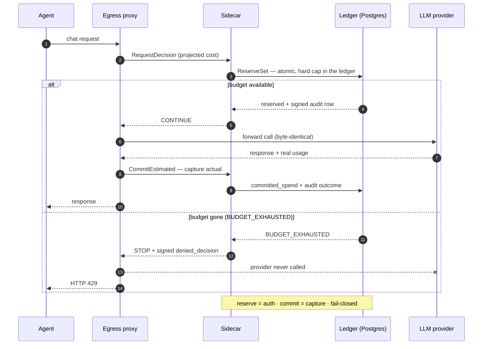

<div align="center">

# 🛡️ Agentic SpendGuard

[English](README.md) · [繁體中文](README.zh-TW.md) · **简体中文**

**给 LLM agent 用的开销防火墙。**

在 provider 被调用*之前*就先把预算 reserve 下来 —— 预算一旦花完,就在那一刻直接拦下这次
调用,并附上一条带签名的审计轨迹说明原因。它不是又一个等账单落地之后才给你看的 dashboard。

🔌 **~20 个 in-process 拦截 adapter** —— LangChain · OpenAI Agents · Vercel AI ·
Mastra · LlamaIndex · AutoGen · Strands · n8n · Dify · LiteLLM … —— 外加给任何
OpenAI 兼容 client 用的 drop-in 接法。

[](LICENSE)
[](https://pypi.org/project/spendguard-sdk/)
[](https://www.npmjs.com/package/@spendguard/sdk)
[](docs/integrations.md)
[](services/)
[](services/ledger/migrations/)
[](proto/)
[](CONTRIBUTING.md)

[快速开始](#-快速开始) · [工作原理](#%EF%B8%8F-工作原理) · [Benchmark](#-benchmark) · [集成列表](docs/integrations.md) · [架构](ARCHITECTURE.md)

</div>

---

## 为什么

凌晨 2:47,一个客服 agent 调用了一个被 rate limit 的工具。retry 循环开始重新规划、
重新 prompt、重新尝试 —— 每一次重试都是一次带着完整 context 的全新 `gpt-4o` 调用。
四十分钟后,这一个卡住的对话烧掉了大约 $380。而你要等到第二天早上 provider 的
dashboard 刷新,才会发现。

“监控用量、发告警”是**对账** —— 你是在账单落地*之后*才看到它。SpendGuard 做的是
**控制**:每一个请求在 provider 被调用*之前*,都会先到 per-tenant 的 ledger 上
reserve 一笔预算。预算没了 → 这次调用直接被拦下,provider 根本不会被请求到。

如果你用过 Stripe:这就是 **auth/capture,套在 LLM token 上**。调用前先 reserve
预估成本,调用后再 capture 真实的 `usage`。idempotent、atomic、fail-closed。

<p align="center">
  
</p>

<p align="center"><sub>一笔 $2000 的 claim 撞上 $1000 的 hard cap —— <b>在 provider 被调用之前就被拦下</b>,并写下一条带签名的 <code>denied_decision</code> 审计记录。本地复现:<code>make demo-up DEMO_MODE=deny</code></sub></p>

## 🚀 快速开始

### 1. 看它拦下一个失控循环 —— 30 秒,不用 API key

```bash
git clone https://github.com/m24927605/agentic-spendguard.git
cd agentic-spendguard
make try          # 只需要 Docker —— 不用 OpenAI key,也不会真的花钱
```

`make try` 会跑 [runaway-loop benchmark](#-benchmark):一个 agent 在 $1.00 的预算下
尝试发起 100 次调用,和另外两套预算工具正面对比,对手是一个 **mock** 的 LLM(所以不用
provider key,也不会真的花钱)。你会看到 SpendGuard *在调用前*就在 **$0.90** 停下来,
而 `agent-guard` 完全没察觉,一路把循环跑到 **$18** —— 超预算 20 倍。

### 2. 把它放到你自己的 `gpt-4o` 调用前面

```bash
export OPENAI_API_KEY=sk-...
make demo-up DEMO_MODE=proxy
```

这会把 Postgres + ledger + sidecar + egress proxy 整套拉起来,然后真的跑一次
`gpt-4o-mini` 调用。**你的应用代码只改一行:**

```python
from openai import OpenAI

client = OpenAI(
    base_url="http://localhost:9000/v1",   # ← 只改这里
    api_key=os.environ["OPENAI_API_KEY"],
)
client.chat.completions.create(model="gpt-4o-mini", messages=[...])
```

| 决策 | HTTP | 结果 |
|---|---|---|
| **CONTINUE**(还有预算) | 200 | provider 响应按字节原样返回;ledger 写入一行 `commit_estimated` 审计记录 |
| **STOP**(超过 hard cap) | 429 + `Retry-After` | 结构化的 `spendguard_blocked` 响应体 —— **这个请求根本到不了 provider** |

## 📊 Benchmark

同一个 fixture —— 100 次尝试调用、$1.00 预算、每次 $0.18 —— 分别丢给三套 drop-in
预算工具去跑,再拿一张 ground-truth 的定价表来对:

<p align="center">
  
</p>

| Runner | 实际发出调用数 | 花掉的 $ | 超支 |
|---|---:|---:|---:|
| **Agentic SpendGuard** | 5 | $0.90 | **−10%** ✅ |
| `agentbudget` | 6 | $1.08 | +8%(*调用后*才拦) |
| `agent-guard` | 100 | $18.00 | **+1700%** ❌(指到自建 base URL 就直接失效) |

SpendGuard 是去 ledger 上做**调用前 reserve**,在第 6 次调用离开 runner 之前就把它拦掉
—— 三套里面唯一一套自始至终没超支的。自己跑一下:**`make try`**(或在
[`benchmarks/runaway-loop/`](benchmarks/runaway-loop/) 里 `make benchmark`)。

## 🛡️ 工作原理

三层。你的 client 只跟 proxy 打交道。

```
agent ──HTTP──▶ egress-proxy ──UDS gRPC──▶ sidecar ──mTLS gRPC──▶ ledger
                     │                                              │
                     └── CONTINUE 时一个 byte 不差地转发            ▼
                                              audit_outbox(带签名、append-only)
                                                                    │
                                              outbox-forwarder ─▶ canonical_ingest ─▶ 你的 SIEM
```

1. **Egress proxy**(Rust + axum)—— 实现 OpenAI Chat Completions / Responses 的
   wire protocol;`CONTINUE` 时一个 byte 不差地转发,`STOP` 时直接返回 HTTP 429,
   完全不调用 provider。
2. **Sidecar**(Rust + tonic,走 UDS)—— 每个 pod 一份的 Contract DSL evaluator;
   决定 `Continue` / `Stop` / `RequireApproval` / `Degrade`;每一个决策都签名
   (Ed25519 或 AWS KMS ECDSA P-256)。
3. **Ledger + 审计链**(Postgres)—— append-only 的复式记账 ledger;**hard cap 就在
   ledger 本身强制执行**(`BUDGET_EXHAUSTED`)。`audit_outbox` 的每一行都不可变
   (靠 DB trigger)而且带签名 —— 防篡改,一旦被改就能发现。

每一个请求 —— 调用前先 reserve,调用后 capture 真实成本,预算一没就拒绝:



→ 完整细节看 **[ARCHITECTURE.md](ARCHITECTURE.md)**。

## 🎚️ 能力级别

按照你能多大程度上信任 agent 的代码“不会绕过这道关卡”,选一个对应的信任模型。

| 级别 | 机制 | 残留的绕过风险 |
|---|---|---|
| **L0** advisory_sdk | SDK 记录决策,但从不拦 | 直接跳过 SDK 的代码 |
| **L1** semantic_adapter | SDK 在 `STOP` 时拒绝对上游的调用 | 直接 import provider 的 client |
| **L2** egress_proxy_hard_block | network proxy 拒绝未经把关的 egress(再加 NetworkPolicy) | 无 |
| **L3** provider_key_gateway | provider key 只放在 server 端,agent 自始至终看不到 | 无 |

## 🔌 集成

两种接入方式:**drop-in proxy**(一个环境变量,不写代码)或 **framework adapter**
(把 model 对象包一层)。目前提供的有 ~20 个 in-process 拦截 adapter + drop-in 接法
—— 可以直接装的这些:

### 🧩 Agent 框架

| 框架 | 安装 |
|---|---|
| LangChain / LangGraph | `pip install 'spendguard-sdk[langchain]'` · `npm i @spendguard/langchain` |
| OpenAI Agents SDK | `pip install 'spendguard-sdk[openai-agents]'` · `npm i @spendguard/openai-agents` |
| Vercel AI SDK | `npm i @spendguard/vercel-ai` |
| Mastra | `npm i @spendguard/mastra` |
| Inngest AgentKit | `npm i @spendguard/inngest-agent-kit` |
| Pydantic-AI · Google ADK · AWS Strands · LlamaIndex | `pip install 'spendguard-sdk[<name>]'` |
| DSPy · Agno · BeeAI · AutoGen / AG2 · SmolAgents · Letta · Atomic Agents | `pip install 'spendguard-sdk[<name>]'` |
| Microsoft Agent Framework | `pip install 'spendguard-sdk[agent-framework]'` · .NET adapter 在 [`sdk/dotnet-agent-framework/`](sdk/dotnet-agent-framework/) |

### 🔧 No-code / 可视化搭建工具与 gateway

| 工具 | 安装 |
|---|---|
| n8n | `n8n-nodes-spendguard`(社区 node) |
| Flowise | `npm i @spendguard/flowise-nodes`(自定义 node) |
| Botpress | `npm i @spendguard/botpress-integration` |
| Dify | model-provider plugin —— [`plugins/dify/`](plugins/dify/) |
| Langflow | 自定义 component —— [`plugins/langflow/`](plugins/langflow/) |
| Kong AI Gateway | Go plugin —— [`plugins/kong/`](plugins/kong/) |
| LiteLLM(proxy guardrail · callback · SDK shim) | `pip install 'spendguard-sdk[litellm]'` |

### ⚡ Drop-in —— 一个环境变量,不用 SDK

| 工具 | 怎么接 |
|---|---|
| 任何 OpenAI 兼容的 client | `base_url=<proxy>` |
| LobeChat | `OPENAI_PROXY_URL=<proxy>` |
| AnythingLLM | Generic-OpenAI provider 的 Base URL |
| Coze Studio | model-provider 的 Base URL |
| OpenClaw | custom-provider 的 `baseUrl`(或 `npm i @spendguard/openclaw-provider-plugin`) |
| Anthropic `claude-agent-sdk` | egress proxy + root CA(BYOK) |

**→ 完整对照表(~40 个接触面 —— adapter + 接法 + importer + 实验性)** —— 含 AG-UI
开销事件、LiveKit/Pipecat 语音 reservation、厂商 VM 的用量 importer(Devin · Manus ·
Genspark)、Microsoft Agent Governance Toolkit([已 merge 进上游](https://github.com/microsoft/agent-governance-toolkit/pull/2398))、
安装片段,以及每个集成各自的 demo 关卡:**[docs/integrations.md](docs/integrations.md)。**

## 📦 SDK

如果你要 approval 流程、model 降级(degrade),或多预算的 claim,直接用 SDK:

```bash
pip install spendguard-sdk          # Python
npm install @spendguard/sdk         # TypeScript
```

```python
async with SpendGuardClient(socket_path="/var/run/spendguard/adapter.sock",
                            tenant_id=TENANT) as sg:
    await sg.handshake()
    outcome = await sg.request_decision(trigger="LLM_CALL_PRE", ...)
    # CONTINUE → 去发这次调用;DecisionStopped / ApprovalRequired 会 raise。
```

## 🚀 跑起来

**先试一下(demo,约 1 分钟):** `make demo-up DEMO_MODE=proxy` —— 通过
[`deploy/demo/compose.yaml`](deploy/demo/compose.yaml) 把整套拉起来,含 PKI bootstrap
和内部 mTLS。详见[快速开始](#-快速开始)。

**正式上线(Kubernetes):**

1. 准备好 **Postgres 16**、**cert-manager**(内部 mTLS),以及 —— 要做生产环境签名的话
   —— **AWS KMS**(通过 IRSA 用 ECDSA P-256)。
2. 用 production profile 安装整套:
   ```bash
   helm install spendguard charts/spendguard \
     -f charts/spendguard/values-production.example.yaml \
     --set chart.profile=production
   ```
   `chart.profile=production` 在 **render 那一刻就是 fail-closed** —— 没给真实的 DB
   Secret、签名审计模式、真实的 bundle/trust-root hash、mTLS/SVID 配置,以及一个明确的
   NetworkPolicy 姿态,它就拒绝把 template 渲染出来。
3. 把你的 app 指到部署好的 egress proxy —— 和 demo 一样就那一行:
   ```python
   base_url = "https://<egress-proxy-host>/v1"
   ```

→ Production values 契约:[`docs/deployment/production-helm-values.md`](docs/deployment/production-helm-values.md)
· 迁移 / 回滚:[`docs/operations/`](docs/operations/)
· 在 `kind` 上验证一次 render:[`scripts/helm-validate-kind.sh`](scripts/helm-validate-kind.sh)

> **Beta —— 正式上线前请先验证。** 这个 production profile 过了 `kind` 验证,但真实
> 世界的使用量还有限;先放在你自己的检查机制后面灰度跑(pilot)一阵子。

## 📚 文档

- [**架构**](ARCHITECTURE.md) —— 组件、数据模型、不变量。
- [**集成**](docs/integrations.md) —— 完整 adapter 对照表 + demo 模式。
- [**规格**](docs/specs/) —— 权威、带版本的 single source of truth
  ([ledger](docs/ledger-storage-spec-v1alpha1.md)、
  [contract DSL](docs/contract-dsl-spec-v1alpha1.md)、
  [trace schema](docs/trace-schema-spec-v1alpha1.md)、
  [sidecar](docs/sidecar-architecture-spec-v1alpha1.md))。
- [**贡献指南**](CONTRIBUTING.md) · [**安全**](SECURITY.md) · [**行为准则**](CODE_OF_CONDUCT.md)

## 现状

单一维护者、Apache-2.0、**Beta**。~20 个 in-process 拦截 adapter,外加 drop-in 接法 /
账单 importer,大多都带 `DEMO_MODE` 关卡,以及一条带签名、一旦被改动就能发现(tamper-evident)的审计链;目前生产环境
的使用量还有限。wire 规格和审计不变量都是 append-only —— **要动 `proto/` 或
`migrations/` 之前,请先提一个 issue。** 欢迎提 PR。

## 许可证

[Apache 2.0](LICENSE)。

SpendGuard 为了做 predictor 验证,vendoring 了一些 tokenizer asset。Llama tokenizer
那条路径用到 Meta Llama 3.1 衍生的文件,属于 *Built with Llama*;在重新分发或启用那条
路径之前,attribution 和 Meta Llama 3.1 Acceptable Use Policy 的相关义务,请先看
[`crates/spendguard-tokenizer/LICENSE_NOTICES.md`](crates/spendguard-tokenizer/LICENSE_NOTICES.md)。
