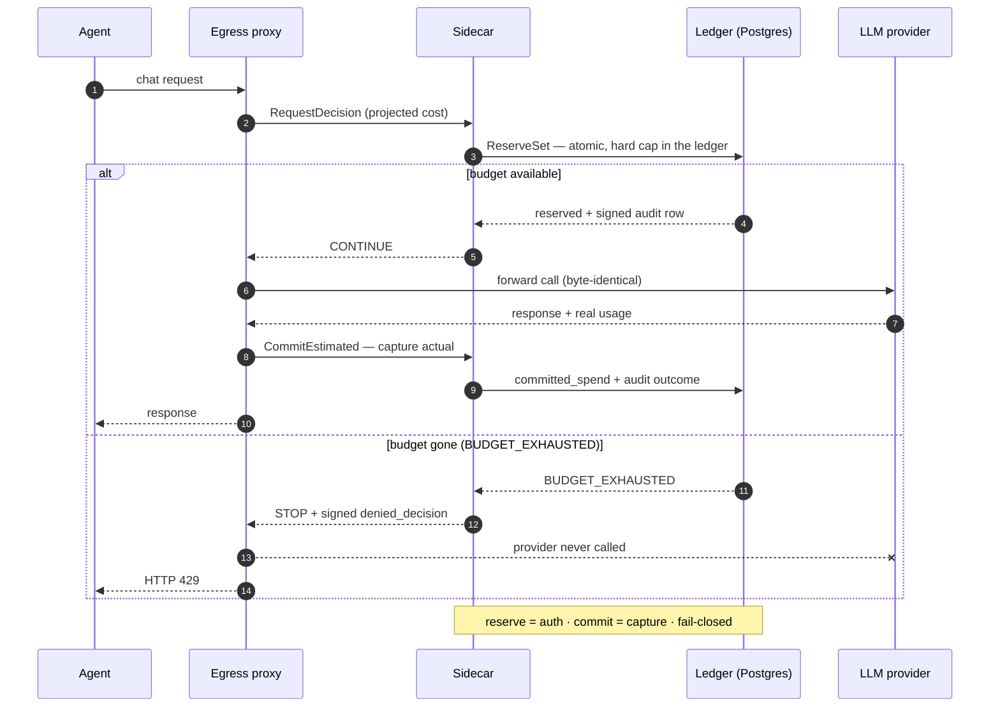

<div align="center">

# 🛡️ Agentic SpendGuard

[English](README.md) · **繁體中文** · [简体中文](README.zh-CN.md)

**給 LLM agent 的花費防火牆。**

在 provider 被呼叫*之前*就先 reserve 好預算 —— 預算一用完,當下就直接擋掉這次呼叫,
還附上一份有簽章的稽核軌跡告訴你為什麼。它不是那種帳單入帳之後才給你看的 dashboard。

🔌 **~20 個 in-process 攔截 adapter** —— LangChain · OpenAI Agents · Vercel AI ·
Mastra · LlamaIndex · AutoGen · Strands · n8n · Dify · LiteLLM … —— 外加給任何
OpenAI 相容 client 用的 drop-in 套法。

[](LICENSE)
[](https://pypi.org/project/spendguard-sdk/)
[](https://www.npmjs.com/package/@spendguard/sdk)
[](docs/integrations.md)
[](services/)
[](services/ledger/migrations/)
[](proto/)
[](CONTRIBUTING.md)

[快速開始](#-快速開始) · [運作原理](#%EF%B8%8F-運作原理) · [Benchmark](#-benchmark) · [整合列表](docs/integrations.md) · [架構](ARCHITECTURE.md)

</div>

---

## 為什麼

凌晨 2:47,一個客服 agent 打到一個被 rate limit 的工具。retry 迴圈開始重新規劃、
重新 prompt、重新嘗試 —— 每一次重試都是一通帶著完整 context 的全新 `gpt-4o` 呼叫。
四十分鐘後,這一個卡住的對話燒掉了大約 $380。而你要等到隔天早上 provider 的
dashboard 更新,才會發現。

「追蹤用量、發警報」是**對帳** —— 你是在帳單入帳*之後*才看到它。SpendGuard 做的是
**控制**:每一個請求在 provider 被呼叫*之前*,都會先到 per-tenant 的 ledger 上
reserve 一筆預算。預算沒了 → 這通呼叫直接被擋下,provider 根本不會被打到。

如果你用過 Stripe:這就是 **auth/capture,套用在 LLM token 上**。呼叫前先 reserve
預估成本,呼叫後再 capture 真實的 `usage`。idempotent、atomic、fail-closed。

<p align="center">
  
</p>

<p align="center"><sub>一筆 $2000 的 claim 撞上 $1000 的 hard cap —— <b>在 provider 被呼叫之前就被擋下</b>,並寫下一筆有簽章的 <code>denied_decision</code> 稽核紀錄。本機重現:<code>make demo-up DEMO_MODE=deny</code></sub></p>

## 🚀 快速開始

### 1. 看它擋下一個失控迴圈 —— 30 秒,不用 API key

```bash
git clone https://github.com/m24927605/agentic-spendguard.git
cd agentic-spendguard
make try          # 只需要 Docker —— 不用 OpenAI key,也不會真的花到錢
```

`make try` 會跑 [runaway-loop benchmark](#-benchmark):一個 agent 在 $1.00 的預算下
嘗試打 100 通呼叫,跟另外兩套預算工具正面對決,對手是一個 **mock** 的 LLM(所以不用
provider key,也不會真的花到錢)。你會看到 SpendGuard *在呼叫前*就在 **$0.90** 停下來,
而 `agent-guard` 完全沒察覺,一路把迴圈跑到 **$18** —— 超出預算 20 倍。

### 2. 把它擺到你自己的 `gpt-4o` 呼叫前面

```bash
export OPENAI_API_KEY=sk-...
make demo-up DEMO_MODE=proxy
```

這會把 Postgres + ledger + sidecar + egress proxy 整套帶起來,然後真的跑一通
`gpt-4o-mini` 呼叫。**你的應用程式只要改一行:**

```python
from openai import OpenAI

client = OpenAI(
    base_url="http://localhost:9000/v1",   # ← 只改這裡
    api_key=os.environ["OPENAI_API_KEY"],
)
client.chat.completions.create(model="gpt-4o-mini", messages=[...])
```

| 決策 | HTTP | 結果 |
|---|---|---|
| **CONTINUE**(還有預算) | 200 | provider 的回應一個 byte 都不差地原樣傳回;ledger 寫下一列 `commit_estimated` 稽核紀錄 |
| **STOP**(超過 hard cap) | 429 + `Retry-After` | 結構化的 `spendguard_blocked` 回應 body —— **這個請求根本到不了 provider** |

## 📊 Benchmark

同一個 fixture —— 100 通嘗試呼叫、$1.00 預算、每通 $0.18 —— 分別丟給三套 drop-in
預算工具去跑,再拿一張 ground-truth 的定價表來對:

<p align="center">
  
</p>

| Runner | 實際送出呼叫數 | 花掉的 $ | 超支 |
|---|---:|---:|---:|
| **Agentic SpendGuard** | 5 | $0.90 | **−10%** ✅ |
| `agentbudget` | 6 | $1.08 | +8%(*呼叫後*才擋) |
| `agent-guard` | 100 | $18.00 | **+1700%** ❌(指到自架 base URL 就直接失效) |

SpendGuard 是去 ledger 上做**呼叫前 reserve**,在第 6 通呼叫離開 runner 之前就把它擋掉
—— 三套裡面唯一一套從頭到尾沒超支的。自己跑跑看:**`make try`**(或在
[`benchmarks/runaway-loop/`](benchmarks/runaway-loop/) 裡 `make benchmark`)。

## 🛡️ 運作原理

三層。你的 client 只會跟 proxy 講話。

```
agent ──HTTP──▶ egress-proxy ──UDS gRPC──▶ sidecar ──mTLS gRPC──▶ ledger
                     │                                              │
                     └── CONTINUE 時一個 byte 都不差地轉發          ▼
                                              audit_outbox(有簽章、append-only)
                                                                    │
                                              outbox-forwarder ─▶ canonical_ingest ─▶ 你的 SIEM
```

1. **Egress proxy**(Rust + axum)—— 講 OpenAI Chat Completions / Responses 的
   wire protocol;`CONTINUE` 時一個 byte 都不差地轉發,`STOP` 時直接回 HTTP 429,
   完全不會去呼叫 provider。
2. **Sidecar**(Rust + tonic,走 UDS)—— 每個 pod 一份的 Contract DSL evaluator;
   決定 `Continue` / `Stop` / `RequireApproval` / `Degrade`;每一個決策都簽章
   (Ed25519 或 AWS KMS ECDSA P-256)。
3. **Ledger + 稽核鏈**(Postgres)—— append-only 的複式記帳 ledger;**hard cap 是在
   ledger 本身強制執行的**(`BUDGET_EXHAUSTED`)。`audit_outbox` 的每一列都不可變
   (靠 DB trigger)而且有簽章 —— 被動過就看得出來。

每一個請求 —— 呼叫前先 reserve,呼叫後 capture 真實成本,預算一沒了就拒絕:



→ 完整細節看 **[ARCHITECTURE.md](ARCHITECTURE.md)**。

## 🎚️ 能力層級

依照你有多信任 agent 的程式碼不會繞過這道關卡,挑一個對應的信任模型。

| 層級 | 機制 | 殘留的繞過風險 |
|---|---|---|
| **L0** advisory_sdk | SDK 記錄決策,但從不擋下 | 直接跳過 SDK 的程式碼 |
| **L1** semantic_adapter | SDK 在 `STOP` 時拒絕對上游的呼叫 | 直接 import provider 的 client |
| **L2** egress_proxy_hard_block | network proxy 拒絕未經把關的 egress(再加 NetworkPolicy) | 無 |
| **L3** provider_key_gateway | provider key 只放在 server 端,agent 從頭到尾看不到 | 無 |

## 🔌 整合

兩種接法:**drop-in proxy**(一個環境變數,不用寫 code)或 **framework adapter**
(把 model 物件包起來)。目前出貨的有 ~20 個 in-process 攔截 adapter + drop-in 套法
—— 可以直接裝的這些:

### 🧩 Agent 框架

| 框架 | 安裝 |
|---|---|
| LangChain / LangGraph | `pip install 'spendguard-sdk[langchain]'` · `npm i @spendguard/langchain` |
| OpenAI Agents SDK | `pip install 'spendguard-sdk[openai-agents]'` · `npm i @spendguard/openai-agents` |
| Vercel AI SDK | `npm i @spendguard/vercel-ai` |
| Mastra | `npm i @spendguard/mastra` |
| Inngest AgentKit | `npm i @spendguard/inngest-agent-kit` |
| Pydantic-AI · Google ADK · AWS Strands · LlamaIndex | `pip install 'spendguard-sdk[<name>]'` |
| DSPy · Agno · BeeAI · AutoGen / AG2 · SmolAgents · Letta · Atomic Agents | `pip install 'spendguard-sdk[<name>]'` |
| Microsoft Agent Framework | `pip install 'spendguard-sdk[agent-framework]'` · .NET adapter 在 [`sdk/dotnet-agent-framework/`](sdk/dotnet-agent-framework/) |

### 🔧 No-code / 視覺化建構工具與 gateway

| 工具 | 安裝 |
|---|---|
| n8n | `n8n-nodes-spendguard`(社群 node) |
| Flowise | `npm i @spendguard/flowise-nodes`(自訂 node) |
| Botpress | `npm i @spendguard/botpress-integration` |
| Dify | model-provider plugin —— [`plugins/dify/`](plugins/dify/) |
| Langflow | 自訂 component —— [`plugins/langflow/`](plugins/langflow/) |
| Kong AI Gateway | Go plugin —— [`plugins/kong/`](plugins/kong/) |
| LiteLLM(proxy guardrail · callback · SDK shim) | `pip install 'spendguard-sdk[litellm]'` |

### ⚡ Drop-in —— 一個環境變數,不用 SDK

| 工具 | 怎麼接 |
|---|---|
| 任何 OpenAI 相容的 client | `base_url=<proxy>` |
| LobeChat | `OPENAI_PROXY_URL=<proxy>` |
| AnythingLLM | Generic-OpenAI provider 的 Base URL |
| Coze Studio | model-provider 的 Base URL |
| OpenClaw | custom-provider 的 `baseUrl`(或 `npm i @spendguard/openclaw-provider-plugin`) |
| Anthropic `claude-agent-sdk` | egress proxy + root CA(BYOK) |

**→ 完整對照表(~40 個接觸面 —— adapter + 套法 + importer + 實驗性)** —— 含 AG-UI
花費事件、LiveKit/Pipecat 語音 reservation、廠商 VM 的用量 importer(Devin · Manus ·
Genspark)、Microsoft Agent Governance Toolkit([已 merge 進上游](https://github.com/microsoft/agent-governance-toolkit/pull/2398))、
安裝片段,以及每個整合各自的 demo 關卡:**[docs/integrations.md](docs/integrations.md)。**

## 📦 SDK

如果你要 approval 流程、model 降級(degrade),或多預算的 claim,直接用 SDK:

```bash
pip install spendguard-sdk          # Python
npm install @spendguard/sdk         # TypeScript
```

```python
async with SpendGuardClient(socket_path="/var/run/spendguard/adapter.sock",
                            tenant_id=TENANT) as sg:
    await sg.handshake()
    outcome = await sg.request_decision(trigger="LLM_CALL_PRE", ...)
    # CONTINUE → 去打那通呼叫;DecisionStopped / ApprovalRequired 會 raise。
```

## 🚀 實際跑起來

**先試試看(demo,約 1 分鐘):** `make demo-up DEMO_MODE=proxy` —— 透過
[`deploy/demo/compose.yaml`](deploy/demo/compose.yaml) 把整套帶起來,含 PKI bootstrap
跟內部 mTLS。詳見[快速開始](#-快速開始)。

**正式上線(Kubernetes):**

1. 準備好 **Postgres 16**、**cert-manager**(內部 mTLS),以及 —— 要做正式環境簽章的話
   —— **AWS KMS**(透過 IRSA 用 ECDSA P-256)。
2. 用 production profile 安裝整套:
   ```bash
   helm install spendguard charts/spendguard \
     -f charts/spendguard/values-production.example.yaml \
     --set chart.profile=production
   ```
   `chart.profile=production` 在 **render 當下就是 fail-closed** —— 沒給真實的 DB
   Secret、簽章稽核模式、真實的 bundle/trust-root hash、mTLS/SVID 設定,以及一個明確的
   NetworkPolicy 姿態,它就拒絕把 template 跑出來。
3. 把你的 app 指到部署好的 egress proxy —— 跟 demo 一樣就那一行:
   ```python
   base_url = "https://<egress-proxy-host>/v1"
   ```

→ Production 值的契約:[`docs/deployment/production-helm-values.md`](docs/deployment/production-helm-values.md)
· 遷移 / 回滾:[`docs/operations/`](docs/operations/)
· 在 `kind` 上驗證一次 render:[`scripts/helm-validate-kind.sh`](scripts/helm-validate-kind.sh)

> **Beta —— 正式上線前請先驗證。** 這個 production profile 已通過 `kind` 驗證,但
> 實際在正式環境跑過的量還有限;先擺在你自己的檢查機制後面試跑(pilot)一陣子。

## 📚 文件

- [**架構**](ARCHITECTURE.md) —— 元件、資料模型、不變式。
- [**整合**](docs/integrations.md) —— 完整 adapter 對照表 + demo 模式。
- [**規格**](docs/specs/) —— 權威、有版本的 single source of truth
  ([ledger](docs/ledger-storage-spec-v1alpha1.md)、
  [contract DSL](docs/contract-dsl-spec-v1alpha1.md)、
  [trace schema](docs/trace-schema-spec-v1alpha1.md)、
  [sidecar](docs/sidecar-architecture-spec-v1alpha1.md))。
- [**貢獻指南**](CONTRIBUTING.md) · [**安全性**](SECURITY.md) · [**行為準則**](CODE_OF_CONDUCT.md)

## 現況

單一維護者、Apache-2.0、**Beta**。~20 個 in-process 攔截 adapter,外加 drop-in 套法 /
帳單 importer,大多都有 `DEMO_MODE` 關卡,以及一條有簽章、被動過就看得出來的稽核鏈;
目前正式環境的使用量還有限。wire 規格跟稽核不變式都是 append-only —— **要動 `proto/`
或 `migrations/` 之前,請先開一個 issue。** 歡迎發 PR。

## 授權

[Apache 2.0](LICENSE)。

SpendGuard 為了做 predictor 驗證,vendoring 了一些 tokenizer asset。Llama tokenizer
那條路徑用到 Meta Llama 3.1 衍生的檔案,屬於 *Built with Llama*;在重新散布或啟用那條
路徑之前,attribution 跟 Meta Llama 3.1 Acceptable Use Policy 的相關義務,請先看
[`crates/spendguard-tokenizer/LICENSE_NOTICES.md`](crates/spendguard-tokenizer/LICENSE_NOTICES.md)。
